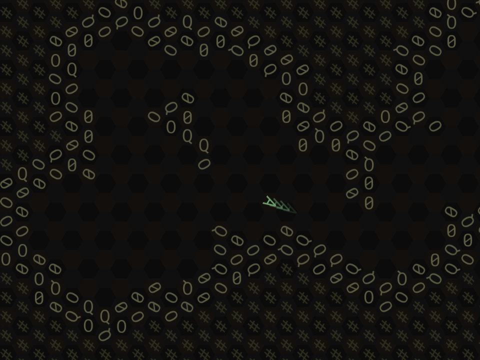

The Asctiiroid
==============

This is an attempt at a turn-based hex-grid cave-flyer for
2018's 7-day roguelike challenge.

Keys (I've used scancodes, so hopefully these are in the QWERTY
positions even if you're using a different keyboard layout):

* WER/SDF - Aim your ship (uses a turn).
* A - Accelerate (uses a turn).
* Q - Boost (higher acceleration if you have fuel: uses a turn).
* Z - Do nothing for one turn (drift at the current velocity).
* G - Use any powerup or exit you touch next turn (doesn't use a turn).
* Space - Fire a shot, if you have ammo.

I've used the Asteroids mechanic where you have a limited number
of active bullets.

I've had this idea in the back of my mind for a year or two.  I
attempted it for a past 7DRL but had an unexpectedly bonkers
week and didn't only got as far as drawing a basic hex grid.

--Josh Grams <josh@qualdan.com>
