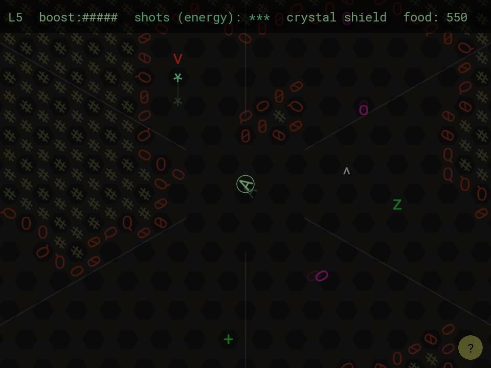

The Yam of Endor
================

A small turn-based Roguelike space game.  Collect food and then
return to the surface to feed a starving space colony.

I've used the Asteroids mechanic where you have a limited number
of active bullets (3 in this case).

Keys (I've used scancodes, so these should be in the QWERTY
positions even if you're using a different keyboard layout):

* UIO/JKL (right hand) - Aim your ship.
* D - Accelerate.
* F (or S) - Fire a shot, if you have ammo.
* E - Boost (higher acceleration if you have fuel).
* R (or W) - Use an exit or grab an upgrade.
* Space - Wait for one turn (drift at the current velocity).
* Tab - show the control help.

Gamepad:

* Left stick - Aim your ship.
* A - Wait for one turn (drift at the current velocity).
* X - Accelerate.
* B - Boost (higher acceleration if you have fuel).
* Y (or left bumper) - Use an exit or grab an upgrade.
* Start - go back to menu.

Enemies
-------

* `O`, `o` (purple): acid jellies.  Hurt you if you touch them.
  When damaged, large ones split into two small ones.

* `>` (red): turrets.  Aim at you and shoot every so many turns.

Objects
-------

* `v`, `^`: exits (down and up).

* `&` (orange): food.  Collect this to feed your starving friends
  and neighbors.

* `C`: crystal shield.  Absorbs one hit, shattering as it does so.

* `B`: bounce shield.  Allows you to bounce off walls, but
  provides no protection from enemies.

* `+`: Boost fuel (10 units).

* `w`: Multi-shot.  Fire all three bullets at once.
  Dramatically shortens the range of your bullets.

* `!`: Single-shot.  Restore single shot mode.

* `z`: Bounce-shot.  Bullets bounce off walls.

-----

I've had this idea in the back of my mind for a year or two.  I
attempted it for the 2017 7DRL but had an unexpectedly bonkers
week and only got as far as drawing a basic hex grid.

--Josh Grams <josh@qualdan.com>
